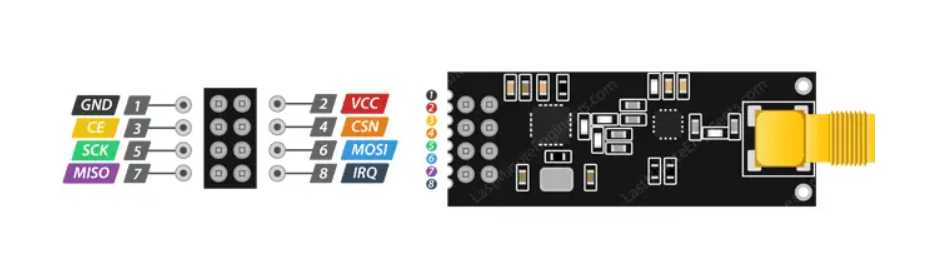
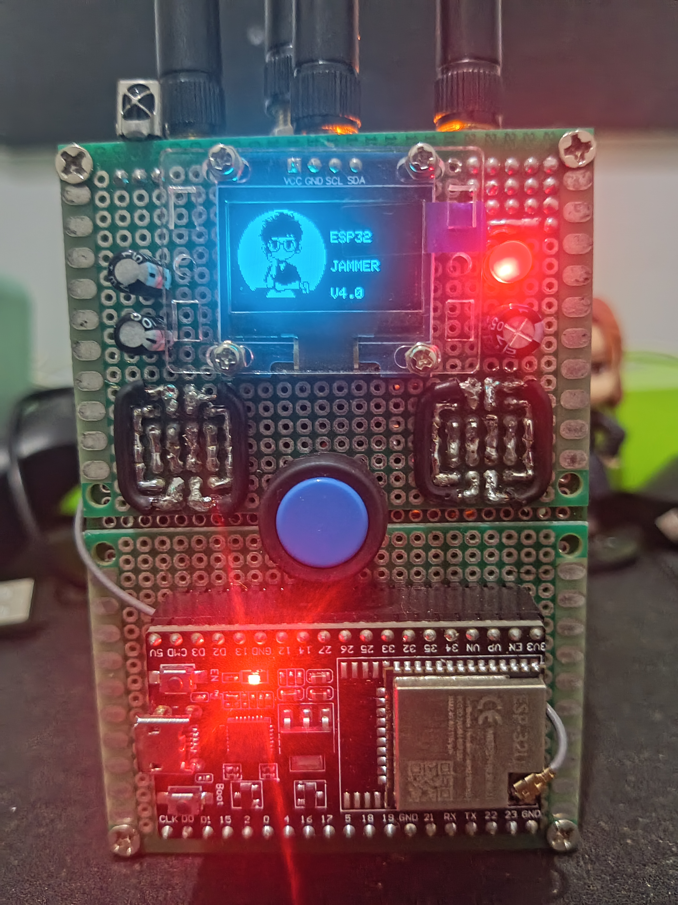
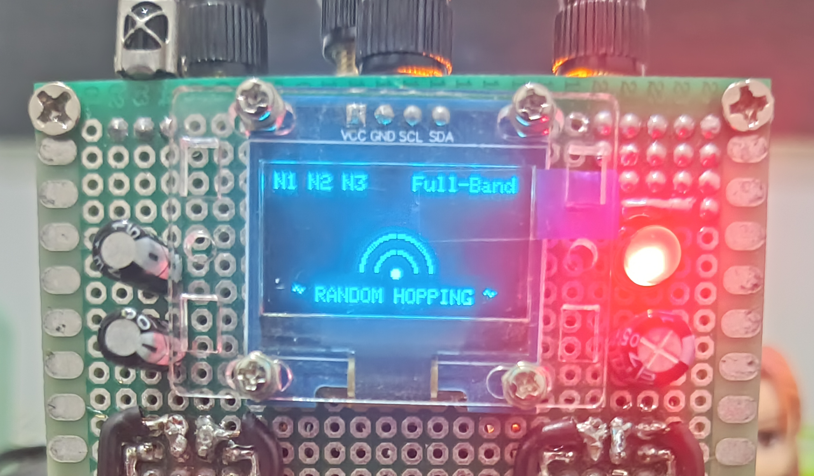
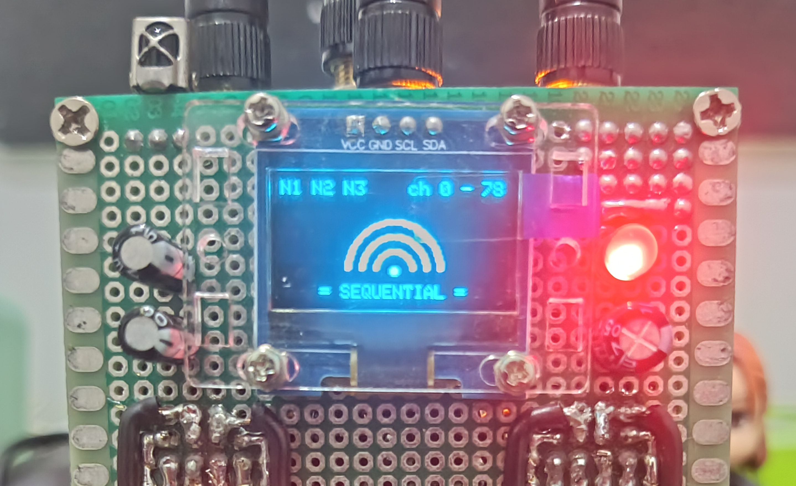
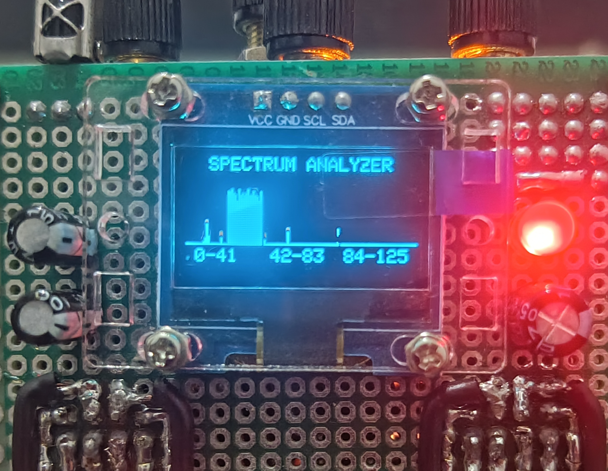

  

 
 

<h3 align="center">‼️WARNING‼️</h3>
<h3 align="center">Do with your own risk. Misuse of this tool is beyond our responsibility, use it wisely!</h3>

 
 

<h1 align="left">ESP32 WIFI BLUETHOOTH JAMMER 2.4GHz</h1>
<h4 align="left">
There are three firmware versions each of them can be compiled with a web flasher. One is free as a trial while the other two are paid versions which I use to buy a coffee☕
</h4>

<h1 align="left">Firmware Price List</h1>
<blockquote>
<h4 align="left">
<b>esp32-jammer-lcd-v1.0</b> 
Price : Free
</h4>
</blockquote>

<blockquote>
<h4 align="left">
<b>esp32-jammer-lcd-v4.0</b> 
Price : IDR 20.000 ($1)
</h4>
</blockquote>

<blockquote>
<h4 align="left">
<b>esp32-jammer-oled-v4.0</b> 
Price : IDR 20.000 ($1)
</h4>
</blockquote>
 
Just pay once and you can access both firmware from the web flasher. For payment, you can DM me on social media section at the bottom. If you have purchased the firmware, I consider you have donated to me. 
 
 
Thank you for your support ^_^

<h1 align="left">Web Flasher</h1>
<h4 align="left">Authentication required (for paid version)</h4>

<h4 align="left">Connect the ESP32 to the laptop USB then install the firmware</h4>

Firmware : esp32-jammer-lcd-v1.0 (FREE)
<blockquote>
<a href="https://flasher-esp32-jammer-free.vercel.app">Web flasher 1</a>
</blockquote>
Firmware : esp32-jammer-lcd-v4.0 (PAID)
<blockquote>
<a href="https://firmware-esp32-jammer-lcd.vercel.app">Web flasher 2</a>
</blockquote>
Firmware : esp32-jammer-oled-v4.0 (PAID)
<blockquote>
<a href="https://firmware-esp32-jammer-oled.vercel.app">Web flasher 3</a>
</blockquote>
<h4 align="left">Paid flasher cannot be accessed if using a github account that is not registered as a buyer.</h4>

<h1 align="left">Features</h1>
<h4 align="left"> <b> Firmware : esp32-jammer-lcd-v1.0 </b> </h4>

<ul>
<li>2 or 3 NRF support</li>
<li>Plug n Play</li>
<li>LCD display</li>
<li>Target ch 1 - 14 only</li>
<li>One single mode (Cross)</li>
</ul>

<h4 align="left"><b>Firmware : esp32-jammer-lcd-v4.0</b></h4>
<ul>
  <li>2 or 3 NRF support</li>
  <li>Plug n Play</li>
  <li>LCD display</li>
  <li>Two technique attacks (Hopping & Cross)</li>
  <li>8 attacks mode (4 for 1 technique)</li>
  <li>WiFi mode</li>
  <li>BLE mode</li>
  <li>Drone mode</li>
  <li>Fullband mode</li>
  <li>Push button support</li>
</ul>

<h4 align="left"><b>Firmware : esp32-jammer-oled-v4.0</b></h4>
<ul>
  <li>2 or 3 NRF support</li>
  <li>Plug n Play</li>
  <li>OLED display</li>
  <li>Cross mode</li>
  <li>Hopping mode</li>
  <li>Hunter mode</li>
  <li>Sequential mode</li>
  <li>Spectrum analyzer</li>
  <li>Push button support</li>
</ul>

<h1 align="left">DEMO</h1>
Watch this video to see how this tool works
<a href="https://www.tiktok.com/@azfamahardika__/video/7633529801629797640?is_from_webapp=1&sender_device=pc&web_id=7642704300384585223">DEMO video</a>  

<h1 align="left">Requirements Device</h1>
<h3 align="left">Primary components</h3>
<ul>
  <li>ESP32 WROOM 32U</li>
  <li>128x64 OLED Display I2C (For oled version)</li>
  <li>LCD 16x2 I2C (For lcd version)</li>
  <li>3x NRF24 Modules (Recommended to use Ebyte ML01DP5)</li>
  <li>3x 2.4GHz Antenna SMA-Male</li>
  <li>Push button</li>
  <li>Power source (Battery)</li>
</ul>
<h3 align="left">Secondary components</h3>
<ul>
  <li>Boost converter (MT3068)</li>
  <li>TP4056</li>
  <li>3x Capacitor elco 100uf</li>
  <li>2x Capacitor elco 1.000uf</li>
  <li>Toggle switch</li>
  <li>NRF24 adapter</li>
  <li>Jumper wires</li>
</ul>  

Note
 
<blockquote>You can find the components in the marketplace.</blockquote>

<h1 align="left">Instructions</h1>
<h3 align="left">➤ STEP 1 : Wiring </h3>
<h4 align="left">ESP32 WROOM 32U</h4>

<h4 align="left">NRF24L01</h4>

<h4 align="left">Ebyte ML01DP5</h4>

You can also use the ML01DP5 module, the pin configuration is exactly the same as the NRF24L01.
<h1></h1>

<h3 align="left"> WIRING SCHEME </h3>
<h4 align="left">If using 3 NRF, this scheme for you</h4>

<h4 align="left">Use this one if using an adapter (recommended)</h4>

<h4 align="left">But, you can also use 2 NRF with a scheme like this</h4>

You can replace the LCD with an OLED, don't worry, the pin configuration is exactly the same using I2C. 
Attach the 2.4GHz antenna to the end of the module. Make sure the ports are aligned.
<h1></h1>

<h3 align="left">PIN CONFIGURATION</h3>

<b>NRF 1 (HSPI)</b>

<ul>
  <li>VCC (+) = 3.3V</li>
  <li>GND (-) = GND</li>
  <li>CE = 26</li>
  <li>CSN = 27</li>
  <li>SCK = 14</li>
  <li>MOSI = 13</li>
  <li>MISO = 12</li>
</ul>

<b>NRF 2 (VSPI)</b>

<ul>
  <li>VCC (+) = 3.3V</li>
  <li>GND (-) = GND</li>
  <li>CE = 17</li>
  <li>CSN = 5</li>
  <li>SCK = 18</li>
  <li>MOSI = 23</li>
  <li>MISO = 19</li>
</ul>

<b>NRF 3 (HSPI)</b>

<ul>
  <li>VCC (+) = 3.3V</li>
  <li>GND (-) = GND</li>
  <li>CE = 32</li>
  <li>CSN = 33</li>
  <li>SCK = 14</li>
  <li>MOSI = 13</li>
  <li>MISO = 12</li>
</ul>

<b>OLED 128x64 || LCD 16x2</b>

<ul>
  <li>VCC (+) = 5V</li>
  <li>GND (-) = GND</li>
  <li>SDA = 21</li>
  <li>SCL = 22</li>
</ul>

<b>PUSH BUTTON</b>

<ul>
  <li>IN = 25</li>
  <li>OUT = GND</li>
</ul>

<h4 align="left">Note</h4>
<blockquote>For dual NRF, you can use HSPI and VSPI configurations. For a single NRF, choose one of the SPI configurations. </blockquote>
<blockquote>For the power source, you can use an external battery connected to the VIN of the ESP32 or just use the USB port. </blockquote>
<blockquote>You can't change the hardware pin configuration because everything is set using the flasher. </blockquote>

<h3 align="left">➤ STEP 2 : Uploading firmware </h3>
After the wiring and pin configuration process is complete, open the web flasher and select the firmware to be used. Make sure your internet connection is stable to anticipate failure of the installation process.
 
 Click here to view the <a href="https://youtu.be/nAdMXXIz-rI">TUTORIAL VIDEO</a>.

<h4 align="left">Requirements</h4>
<ul>
  <li><a href="https://sparks.gogo.co.nz/assets/_site_/downloads/CH34x_Install_Windows_v3_4.zip">CH340 driver</a></li>
  <li><a href="https://www.silabs.com/documents/public/software/CP210x_Windows_Drivers.zip">CP2102 driver</a></li>
  <li>USB data cable</li>
</ul>

<h4 align="left">Troubleshoot</h4>
<blockquote>If the installation process fails, reinstall the firmware while pressing and holding the BOOT button on the ESP32 board.</blockquote>
<blockquote>If the COM port is not detected, try using another laptop port and make sure to use a data cable (not a charging cable).</blockquote>

<h3 align="left">➤ STEP 3 : Explanation</h3>
After a successful installation, you can turn on the device. Make sure your hardware wiring is correct.

<h3 align="left">> RESULT (oled version)</h3>
<h4 align="left">Prototype</h4>

<h4 align="left">Random hopping mode</h4>

<h4 align="left">Sequential mode</h4>

<h4 align="left">Spectrum analyzer</h4>

You can build your own version of the prototype.  
LCD version review is in the DEMO video, or click here <a href="https://www.tiktok.com/@azfamahardika__/photo/7632892815738932498?is_from_webapp=1&sender_device=pc&web_id=7642704300384585223">LCD prototype</a>.
<h1></h1>

<h3 align="left">> HOW TO USE ?</h3>

<h4 align="left">For OLED version firmware</h4>

<ul>
  <li>At the top left is the radio status indicator (N1, N2, N3)</li>
  <li>At the top right is the channel range indicator</li>
  <li>Press to change attack mode (Hopping, Cross, Hunter, Sequential)</li>
  <li>Hold to enter spectrum analyzer mode</li>
</ul>

<i>*You can change attack modes to find the most effective technique.</i>

<h4 align="left">For LCD version firmware</h4>

<ul>
  <li>After booting, the LCD displays the NRF status</li>
  <li>Press to change system mode (WIFI, BLE, DRONE, FULLBAND)</li>
  <li>Hold to change attack mode (Random Hopping or Cross Sweeping)</li>
</ul>

<i>*You can switch system mode according to the target.</i>

<h1 align="left"> !! READ THIS !!</h1>
<blockquote><h4 align="left">If the power supply voltage doesn't reach 5V, I recommend purchasing a boost converter to increase the voltage to 5V. However, if the voltage is above 5V, it's best to purchase a buck converter to lower the voltage so your ESP32 doesn't burn out.</h4></blockquote>
<blockquote><h4 align="left"> If the NRF24 or ML01DP5 is powered directly from the battery, ensure the voltage is at 3.3V (3.6V is the maximum). Anything below this limit will reduce jamming performance, including range. Too high a voltage can also cause the module to burn out.</h4></blockquote>

<h1 align="left">Social Media</h1>
<a href="https://www.tiktok.com/@azfamahardika__">TikTok</a>  
<a href="https://www.instagram.com/azfamahardika_">Instagram</a>
