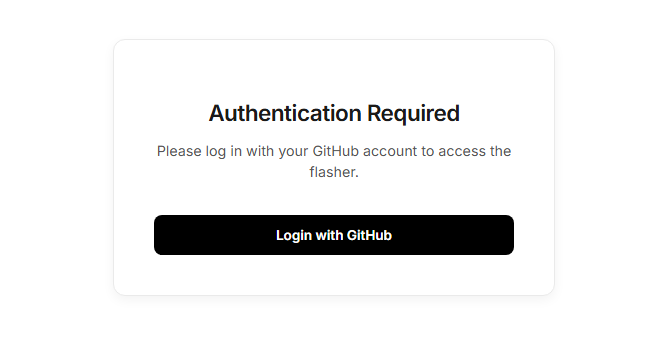
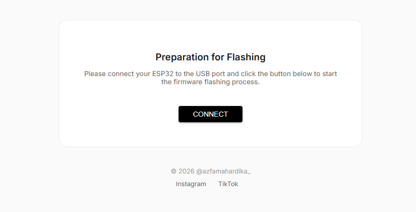
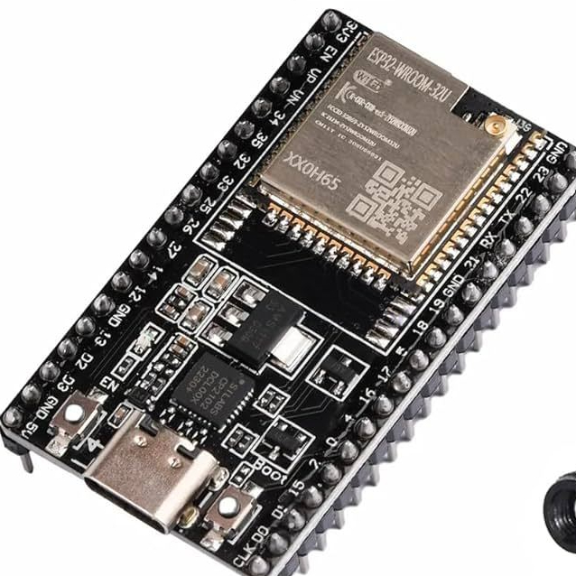
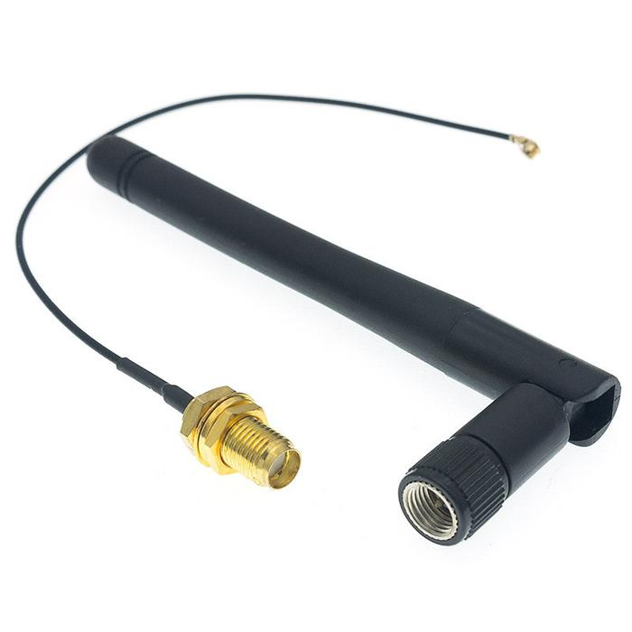
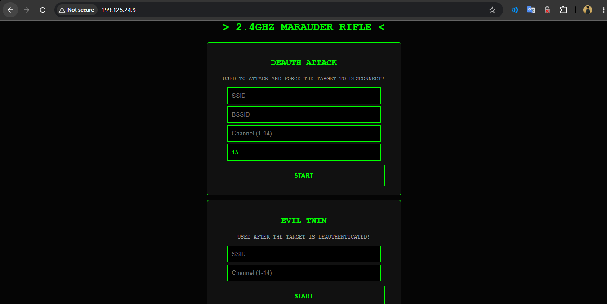
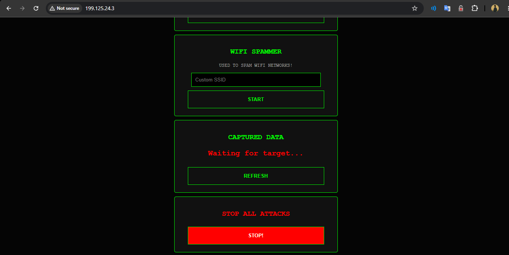
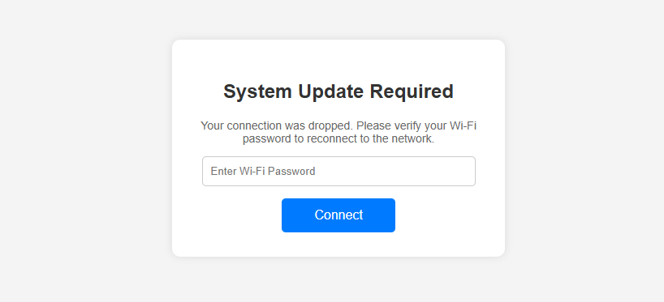

  

 
 

<h3 align="center">‼️WARNING‼️</h3>
<h3 align="center">Do with your own risk. Misuse of this tool is beyond our responsibility, use it wisely!</h3>

 
 

<h1 align="left">ESP32 WIFI DEAUTHER 2.4GHz</h1>
<h4 align="left">
This firmware is quite powerful for disconnecting clients from Wi-Fi. You only need the SSID, BSSID, and Channel to perform deauthentication.
</h4>

<h1 align="left">Firmware Price List</h1>
<blockquote>
<h4 align="left">
<b>esp32-deauther-v4.0</b> 
Price : IDR 20.000 ($1)
</h4>
</blockquote>

 
The firmware is paid, to access the flasher you have to buy the firmware first then you can open the web flasher. For payment, you can DM me on social media section at the bottom. If you have purchased the firmware, I consider you have donated to me. 
 
 
Thank you for your support ^_^

<h1 align="left">Web Flasher</h1>
<h4 align="left">Authentication required</h4>

<h4 align="left">Connect the ESP32 to the laptop USB then install the firmware</h4>

Firmware : esp32-deauther-v4.0
<blockquote>
<a href="https://flasher-esp32-wifi-deauther.vercel.app/">Web flasher</a>
</blockquote>
<h4 align="left">Flasher cannot be accessed if using a github account that is not registered as a buyer.</h4>

<h1 align="left">Features</h1>

<ul>
<li>Deauthentication</li>
<li>Evil Twin</li>
<li>Beacon Spam</li>
<li>Password Catcher (with Evil Twin)</li>
</ul>

<h1 align="left">Requirements Device</h1>
<ul>
  <li>ESP32 WROOM 32U</li>
  <li>2.4GHz SMA antenna U.FL connector</li>
</ul>
<blockquote>You can find the components in the marketplace.</blockquote>

<h1 align="left">Instructions</h1>
<h3 align="left">➤ STEP 1 : Wiring </h3>

 

Just connect the antenna to the ESP32 then power it either via the USB port or the VIN pin, Make sure the U.FL port is connected firmly.
<h1></h1>

<h3 align="left">➤ STEP 2 : Uploading firmware </h3>
After the antenna is successfully connected to the ESP32, open the web flasher and select the firmware to be compiled. Make sure your internet connection is stable to anticipate failure of the installation process.
 
 Click here to view the <a href="https://youtu.be/nAdMXXIz-rI">TUTORIAL VIDEO</a>.

<h4 align="left">Requirements</h4>
<ul>
  <li><a href="https://sparks.gogo.co.nz/assets/_site_/downloads/CH34x_Install_Windows_v3_4.zip">CH340 driver</a></li>
  <li><a href="https://www.silabs.com/documents/public/software/CP210x_Windows_Drivers.zip">CP2102 driver</a></li>
  <li>USB data cable</li>
</ul>

<h4 align="left">Troubleshoot</h4>
<blockquote>If the installation process fails, reinstall the firmware while pressing and holding the BOOT button on the ESP32 board.</blockquote>
<blockquote>If the COM port is not detected, try using another laptop port and make sure to use a data cable (not a charging cable).</blockquote>

<h3 align="left">➤ STEP 3 : Explanation</h3>
After a successful installation, you can turn on the device and ready to use.

<h3 align="left"> HOW TO USE ?</h3>
<ul>
  <li>Once the device is powered on, go to wifi settings and connect your device to the SSID "Galaxy A55 5G" or "ESP32", this is the internal wifi alias of the ESP32 and this is just localhost</li>
  <li>After connected to wifi, open your browser and go to page 199.125.24.3 (it is recommended to open it using Chrome)</li>
  <li>After the IP is entered, the browser will display a panel
    

       

    

  </li>
  <li><b>DEAUTH ATTACK :</b> Used to manipulate the target so that the target forcibly disconnects the client connection.</li>
<li><b>EVIL TWIN :</b> Used to change the internal Wi-Fi SSID name to the target SSID name. It's good to use after a deauth attack is complete. If the client is fooled, they'll open the fake SSID and enter the phishing portal capture website.
 
</li>
  <li><b>WIFI SPAMMER :</b> Used to spam empty SSIDs into the air, the longer the SSID characters the fewer SSIDs that successfully fly into the air.</li>
  <li><b>CAPTURED DATA :</b> Captures the password entered by the client if they enter a fake SSID (Evil Twin) on the capture portal page.</li>
</ul>

  NOTE
<blockquote>If the device cannot connect to wifi, turn off VPN and custom DNS, make sure the web panel is opened in a site state without SSL/TLS (don't worry, this is just localhost).</blockquote>
<blockquote>If the web panel is still inaccessible (usually on an iPhone), you just need to tinker with the Network settings, this happens because the system considers the web panel a threat.</blockquote>
<blockquote>Turn off your cellular data if you access the web panel using a smartphone, make sure the device is offline and only connected to the ESP32 internal wifi.</blockquote>
<blockquote>If you access the panel using a desktop, use a chrome extension to force the web panel to disable SSL/TLS (force HTTP).</blockquote>
<blockquote>Don't spam commands; wait for one process to complete before executing another. It's recommended to execute "STOP ALL ATTACKS" first.</blockquote>
<blockquote>If you want to execute a command, always make sure the device is connected to the ESP32's internal WiFi first and also make sure the device is offline.</blockquote>

<h1 align="left">Social Media</h1>
<a href="https://www.tiktok.com/@azfamahardika__">TikTok</a>  
<a href="https://www.instagram.com/azfamahardika_">Instagram</a>
